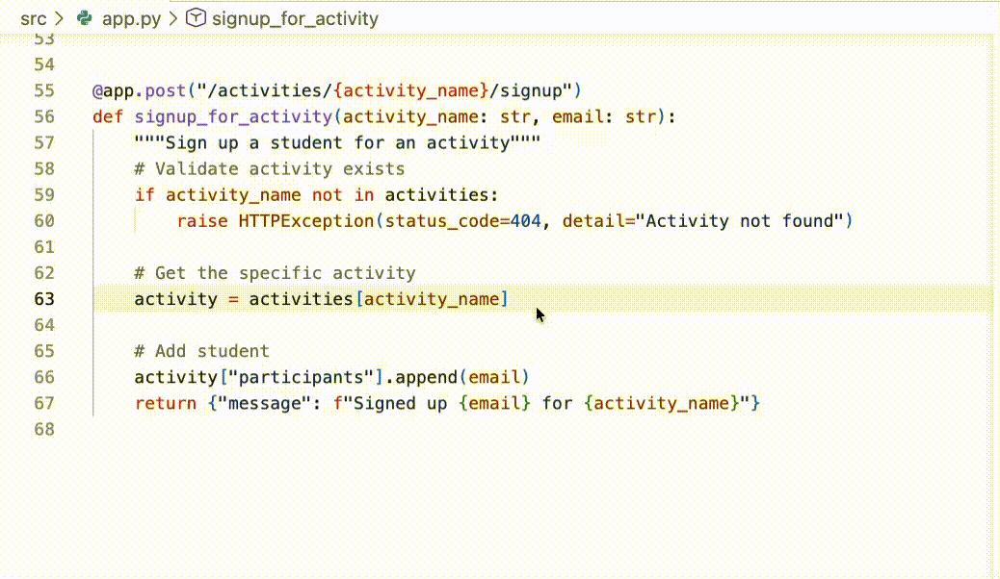
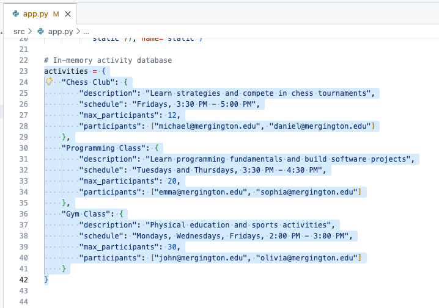
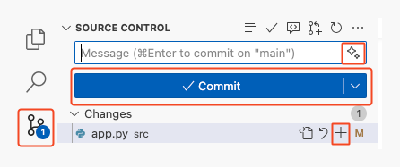

## Step 2: Getting work done with Copilot

In the previous step, GitHub Copilot was able to help us onboard to the project. That alone is a huge time saver, but now let's get some work done!

:bug: **THERE IS A BUG ON THE WEBSITE** :bug:

We’ve discovered that something’s off in the signup flow.
Students can currently register for the same activity **more than once**! Let’s see how far Copilot can take us in uncovering the cause and shaping a clean fix.

Before we dive in, a quick primer on how Copilot works. 🧑‍🚀

### 📖 Theory: How Copilot works

In short, you can think of Copilot like a very specialized coworker. To be effective with them, you need to provide them background (context) and clear direction (prompts). Additionally, different people are better at different things because of their unique experiences (models).

- **How do we provide context?:** In our coding environment, Copilot will automatically consider nearby code and open tabs. If you are using chat, you can also explicitly refer to files.

- **What model should we pick?:** For our exercise, it shouldn't matter too much. Experimenting with different models is part of the fun! That's another lesson! 🤖

- **How do I make prompts?:** Being explicit and clear helps Copilot do the best job. But unlike some traditional systems, you can always clarify your direction with followup prompts.

> [!TIP]
> There several other ways to supplement Copilot's knowledge and capabilities like [chat participants](https://docs.github.com/en/copilot/using-github-copilot/copilot-chat/github-copilot-chat-cheat-sheet?tool=vscode#chat-participants), [chat variables](https://docs.github.com/en/copilot/using-github-copilot/copilot-chat/github-copilot-chat-cheat-sheet?tool=vscode#chat-variables), [slash commands](https://docs.github.com/en/copilot/using-github-copilot/copilot-chat/github-copilot-chat-cheat-sheet?tool=vscode#slash-commands-1), and [MCP tools](https://code.visualstudio.com/docs/copilot/chat/mcp-servers).

### :keyboard: Activity: Use Copilot to fix our registration bug :bug:

1. Let's ask Copilot to suggest where our bug might be coming from. Open the **Copilot Chat** panel in **Ask mode** and ask the following.

   > 
   >
   > ```prompt
   > @workspace Students are able to register twice for an activity.
   > Where could this bug be coming from?
   > ```

1. Now that we know the issue is in the `src/app.py` file and the `signup_for_activity` method, let's follow Copilot's recommendation and go fix it (semi-manually). We'll start with a comment and let Copilot finish the correction.
   1. Open the `src/app.py` file.

      > 💡 **Tip:** If Copilot mentioned `src/app.py` in chat, you can click the file directly in the chat view to open it.

   1. Near the bottom of the file, find the `signup_for_activity` function.

   1. Find the comment line that describes adding a student. Above this is where it seems logical to do our registration check.

   1. Enter the below comment and press enter to go to the next line. After a moment, temporary shadow text will appear with a suggestion from Copilot! Nice! :tada:

      Comment:

      ```python
      # Validate student is not already signed up
      ```

      

   1. Press `Tab` to accept Copilot's suggestion and convert the shadow text to code.

   <details>
   <summary>Example Results</summary><br/>

   Copilot is growing every day and may not always produce the same results. If you are unhappy with the suggestions, here is an example of a valid suggestion result we produced during the making of this exercise. You can use it to continue forward.

   ```python
   @app.post("/activities/{activity_name}/signup")
   def signup_for_activity(activity_name: str, email: str):
      """Sign up a student for an activity"""
      # Validate activity exists
      if activity_name not in activities:
         raise HTTPException(status_code=404, detail="Activity not found")

      # Get the activity
      activity = activities[activity_name]

      # Validate student is not already signed up
      if email in activity["participants"]:
        raise HTTPException(status_code=400, detail="Student is already signed up")

      # Add student
      activity["participants"].append(email)
      return {"message": f"Signed up {email} for {activity_name}"}
   ```

   </details>

### :keyboard: Activity: Let Copilot generate sample data 📋

In new project developments, it's often helpful to have some realistic looking fake data for testing. Copilot is excellent at this task, so let's add some more sample activities and introduce another way to interact with Copilot using **Inline Chat**

**Inline Chat** and the **Copilot Chat** panel are similar, but differ in scope: Copilot Chat handles broader, multi-file or exploratory questions; Inline Chat is faster when you want targeted help on the exact line or block in front of you.

1. Near the top of the `src/app.py` file (about line 23), find the `activities` variable, where our example extracurricular activities are configured.

1. Highlight the entire `activities` dictionary by clicking and dragging your mouse from the top to the bottom of the dictionary. This will help provide context to Copilot for our next prompt.

   


1. Bring up Copilot inline chat by using the keyboard command `Ctrl + I` (windows) or `Cmd + I` (mac).

   > 💡 **Tip:** Another way to bring up Copilot inline chat is: `right click` on any of the selected lines -> `Open Inline Chat`.

1. Enter the following prompt text and press enter or the **Send** button on the right.

   > 
   >
   > ```prompt
   > Add 2 more sports related activities, 2 more artistic
   > activities, and 2 more intellectual activities.
   > ```

1. After a moment, Copilot will directly start making changes to the code. The changes will be stylized differently to make any additions and removals easy to identify. Take a moment to inspect and verify the changes, and then press the **Keep** button.

   <details>
   <summary>Example Results</summary><br/>

   Copilot is growing every day and may not always produce the same results. If you are unhappy with the suggestions, here is an example result we produced during the making of this exercise. You can use it to continue forward, if having trouble.

   ```python
   # In-memory activity database
   activities = {
      "Chess Club": {
         "description": "Learn strategies and compete in chess tournaments",
         "schedule": "Fridays, 3:30 PM - 5:00 PM",
         "max_participants": 12,
         "participants": ["michael@mergington.edu", "daniel@mergington.edu"]
      },
      "Programming Class": {
         "description": "Learn programming fundamentals and build software projects",
         "schedule": "Tuesdays and Thursdays, 3:30 PM - 4:30 PM",
         "max_participants": 20,
         "participants": ["emma@mergington.edu", "sophia@mergington.edu"]
      },
      "Gym Class": {
         "description": "Physical education and sports activities",
         "schedule": "Mondays, Wednesdays, Fridays, 2:00 PM - 3:00 PM",
         "max_participants": 30,
         "participants": ["john@mergington.edu", "olivia@mergington.edu"]
      },
      "Basketball Team": {
         "description": "Competitive basketball training and games",
         "schedule": "Tuesdays and Thursdays, 4:00 PM - 6:00 PM",
         "max_participants": 15,
         "participants": []
      },
      "Swimming Club": {
         "description": "Swimming training and water sports",
         "schedule": "Mondays and Wednesdays, 3:30 PM - 5:00 PM",
         "max_participants": 20,
         "participants": []
      },
      "Art Studio": {
         "description": "Express creativity through painting and drawing",
         "schedule": "Wednesdays, 3:30 PM - 5:00 PM",
         "max_participants": 15,
         "participants": []
      },
      "Drama Club": {
         "description": "Theater arts and performance training",
         "schedule": "Tuesdays, 4:00 PM - 6:00 PM",
         "max_participants": 25,
         "participants": []
      },
      "Debate Team": {
         "description": "Learn public speaking and argumentation skills",
         "schedule": "Thursdays, 3:30 PM - 5:00 PM",
         "max_participants": 16,
         "participants": []
      },
      "Science Club": {
         "description": "Hands-on experiments and scientific exploration",
         "schedule": "Fridays, 3:30 PM - 5:00 PM",
         "max_participants": 20,
         "participants": []
      }
   }
   ```

   </details>

1. You can now go to your website and verify that the new activities are visible.

### :keyboard: Activity: Use Copilot to describe our work 💬

Nice work fixing that bug and expanding the example activities! Now let's get our work committed and pushed to GitHub, again with the help of Copilot!

1. In the left sidebar, select the `Source Control` tab.

   > 💡 **Tip:** Opening a file from the source control area will show the differences to the original rather than simply opening it.

1. Find the `app.py` file and press the `+` sign to collect your changes together in the staging area.

   

1. Above the list of staged changes, find the **Message** text box, but **don't enter anything** for now.
   - Typically, you would write a short description of the changes here, but now we have Copilot to help out!

1. To the right of the **Message** text box, find and click the **Generate Commit Message** button (sparkles icon).

1. Press the **Commit** button and **Sync Changes** button to push your changes to GitHub.

1. Wait a moment for Mona to check your work, provide feedback, and share the next lesson.

<details>
<summary>Having trouble? 🤷</summary><br/>

If you don't get feedback, here are some things to check:

- Make sure your pushed the `src/app.py` file changes to the branch `accelerate-with-copilot`.

</details>
