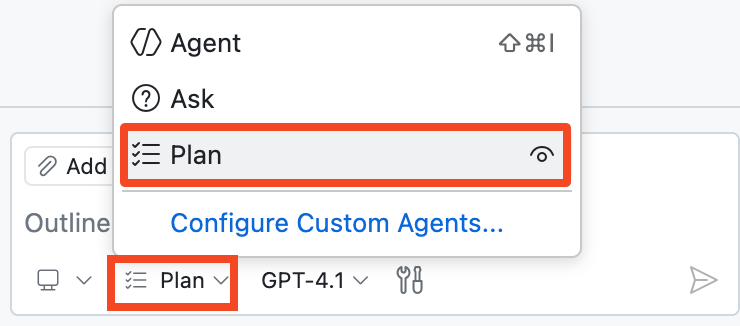
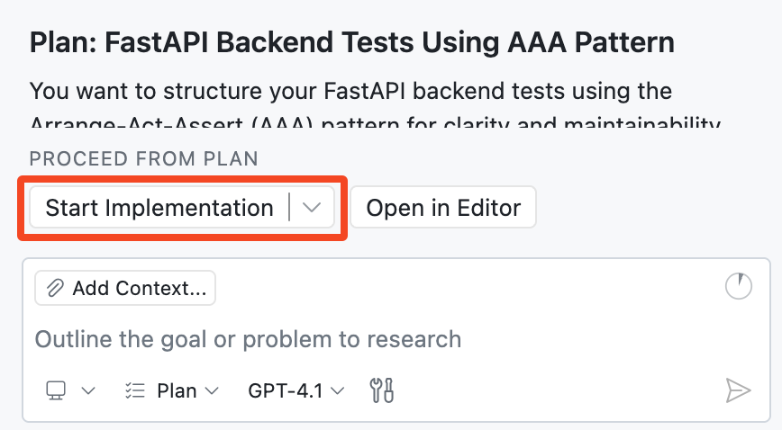

## Step 4: Plan your implementation with the Planning Agent 🧭

In the last step, Agent Mode helped us move fast and ship new functionality. 🚀

Now let's slow down for one round and work like architects: define a strong testing approach first, then hand it off for implementation. This gives us better clarity, fewer surprises, and cleaner results. 🧪

### 📖 Theory: What is Copilot Plan Agent?

Copilot [Plan Agent](https://code.visualstudio.com/docs/copilot/agents/planning) helps you design a solution before any code is changed.

Instead of jumping straight into edits, it researches your request, asks clarifying questions, and drafts an implementation plan you can refine.

#### Plan Agent (at a glance)

| Aspect | 🧭 Plan Agent |
| --- | --- |
| Purpose | Creates a structured implementation plan before coding starts. |
| Context gathering | Uses read-only research to understand requirements and constraints. |
| Collaboration style | Asks clarifying questions, then updates the plan using your answers. |
| Iteration | Supports multiple refinement passes before implementation. |
| Safety | Does not edit files until you approve the plan and hand off to **Agent Mode**. |
| Handoff | **Start implementation** button hands off the approved plan to **Agent Mode** for coding. |

> [!TIP]
> You can start from a high-level request and then add constraints and details in follow-up prompts.

### ⌨️ Activity: Plan and implement backend tests

Your backend still has zero test coverage. Use **Plan Agent** to create a plan, answer questions, and then launch implementation.

1. Open the **Copilot Chat** panel and switch to **Plan Agent**.

   


1. Let's start with a broad prompt and Copilot will help us fill in the details:

   > 
   >
   > ```prompt
   > I want to add backend FastAPI tests in a separate tests directory.
   > ```

1. Wait for Copilot to generate its first plan. If it asks you any questions, answer them to the best of your ability. 

   > 🪧 **Note:** Don't worry about getting it perfect, you can always refine the plan later.

1. You can refine the plan and provide additional details in follow up prompts

   Here are some examples:

   > 
   >
   > ```prompt
   > Let's use the AAA (Arrange-Act-Assert) testing pattern to structure our tests
   > ```

   > 
   >
   > ```prompt
   > Make sure we use `pytest` and add it to `requirements.txt` file
   > ```


1. Review the proposed plan and when you are happy with it, click **Start implementation** to hand off to **Agent Mode**.

   

   Notice that clicking the button switched from **Plan** to **Agent Mode**. From this point on, Copilot can edit your codebase, just like before.

1. Watch Copilot implement the plan you just created. It may ask for permissions to run certain tools (e.g., run commands or create virtual environments). Approve these permissions so it can continue working.

1. Review the changes and make sure tests run successfully. If needed, continue guiding until implementation is complete.

   **🎯 Goal: Get all tests passing (green) before you move on. ✅**

   > 🪧 **Note:** Agent Mode may complete this in one pass, or it may need follow-up prompts from you.

1. **Commit** and **push** all your changes to the `accelerate-with-copilot` branch.

1. Wait for Mona to check your work and share the next step.

<details>
<summary>Having trouble? 🤷</summary><br/>

- If tests did not run, ask Copilot to run them for you.
- Make sure `pytest` is added in `requirements.txt` and a `tests/` directory exists.

</details>
